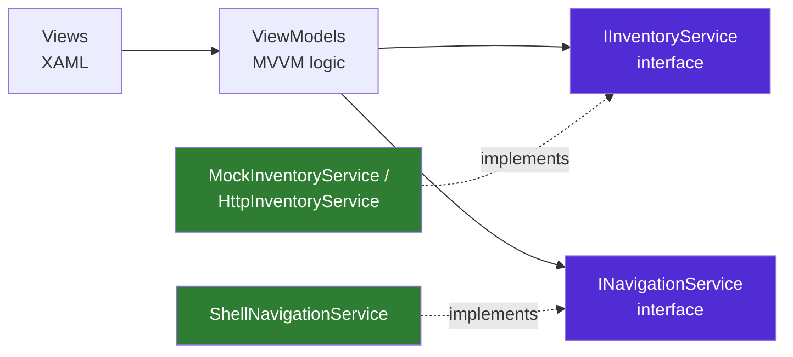
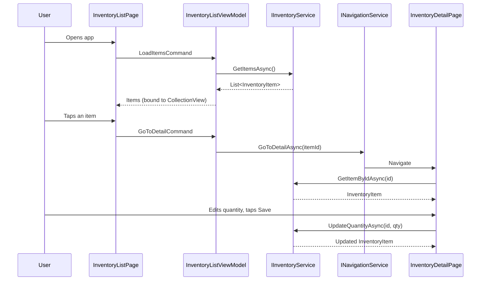

cat > README.md << 'EOF'
# Inventory Management Module — .NET MAUI

Mobile module allowing users to view inventory items and update stock quantities, built as part of a technical assessment for an ERP application.

## Architecture



ViewModels depend only on abstractions (`IInventoryService`, `INavigationService`), never on concrete classes or the MAUI runtime (`Shell.Current`). This means:
- Swapping the mock for a real backend = changing **one DI line** in `MauiProgram.cs`.
- ViewModels are unit-tested as plain .NET objects, with fakes injected for both dependencies.

## Project structure

```
InventoryApp/
├── Models/                       → InventoryItem (pure data, no logic)
├── Services/
│   ├── IInventoryService.cs      → data contract (GET/PUT abstraction)
│   ├── MockInventoryService.cs   → in-memory simulation of the REST API
│   ├── HttpInventoryService.cs   → production-ready real REST API client
│   ├── INavigationService.cs     → navigation contract
│   └── ShellNavigationService.cs → Shell-based navigation implementation
├── ViewModels/
│   ├── BaseViewModel.cs
│   ├── InventoryListViewModel.cs
│   └── InventoryDetailViewModel.cs
├── Views/
│   ├── InventoryListPage.xaml(.cs)
│   └── InventoryDetailPage.xaml(.cs)
├── Converters/
│   └── InvertedBoolConverter.cs
├── MauiProgram.cs                → Dependency Injection registration
└── InventoryApp.Tests/           → xUnit unit tests (service + ViewModel layers)
```

## Why this structure

| Requirement | How it's addressed |
|---|---|
| **Separation of concerns** | Views bind only to ViewModels; ViewModels call only interfaces. |
| **Scalability** | `HttpInventoryService` is provided as a drop-in replacement for the mock, implementing the same contract. |
| **Testability** | Both `IInventoryService` and `INavigationService` are injected, so ViewModels are tested with fakes — no MAUI runtime required. |
| **Error handling** | try/catch + `InventoryServiceException` keeps HTTP-level errors out of the UI layer; failures shown via a bound `ErrorMessage` banner. |
| **SOLID principles** | Dependency Inversion (two service abstractions), Single Responsibility, Open/Closed (new implementations added without modifying consumers). |

## Functional flow



## Running the project

> No database — inventory data is mocked in memory, as specified in the assessment brief.

\`\`\`bash
dotnet workload install maui-android   # Android target (Linux-compatible)
dotnet build -f net8.0-android
\`\`\`

Run the unit tests:

\`\`\`bash
cd InventoryApp.Tests
dotnet test
\`\`\`

