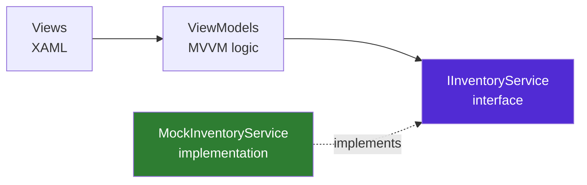
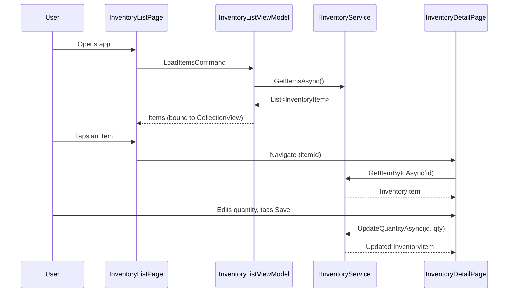

# Inventory Management Module — .NET MAUI

Mobile module allowing users to view inventory items and update stock quantities, built as part of a technical assessment for an ERP application.

## Architecture



The dependency always points **toward the abstraction** (`IInventoryService`), never toward a concrete class. This is the Dependency Inversion Principle in practice: swapping `MockInventoryService` for a real `HttpInventoryService` later requires touching only **one line** in `MauiProgram.cs`.

## Project structure

```
InventoryApp/
├── Models/                          → InventoryItem (pure data, no logic)
├── Services/
│   ├── IInventoryService.cs         → contract (GET/PUT abstraction)
│   └── MockInventoryService.cs      → in-memory simulation of the REST API
├── ViewModels/
│   ├── BaseViewModel.cs             → shared IsBusy / ErrorMessage / Title
│   ├── InventoryListViewModel.cs    → load list + navigate to detail
│   └── InventoryDetailViewModel.cs  → load item + update quantity
├── Views/
│   ├── InventoryListPage.xaml(.cs)
│   └── InventoryDetailPage.xaml(.cs)
├── Converters/
│   └── InvertedBoolConverter.cs
├── MauiProgram.cs                   → Dependency Injection registration
└── InventoryApp.Tests/              → xUnit unit tests
```

## Why this structure

| Requirement | How it's addressed |
|---|---|
| **Separation of concerns** | Views only bind to ViewModels; ViewModels only call the `IInventoryService` interface. No layer skips another. |
| **Scalability** | A real HTTP-based service can replace the mock by changing a single DI registration line — zero impact on UI or business logic. |
| **Testability** | ViewModels receive `IInventoryService` via constructor injection, so unit tests can inject `FakeInventoryService` with no MAUI runtime, no emulator, no network. |
| **Error handling** | Every service call is wrapped in try/catch; a dedicated `InventoryServiceException` keeps transport-level errors (HTTP, timeout) out of the presentation layer; failures are surfaced via a bound `ErrorMessage` banner. |
| **SOLID principles** | Dependency Inversion (interface-based service), Single Responsibility (one job per class), Open/Closed (new implementations can be added without modifying consumers). |

## Functional flow



## Running the project

> No database — inventory data is mocked in memory, as specified in the assessment brief.

```bash
dotnet workload install maui-android   # Android target (Linux-compatible)
dotnet build -f net8.0-android
```

Run the unit tests:

```bash
cd InventoryApp.Tests
dotnet test
```

## Known limitations / next steps

- No persistence beyond the in-memory mock (intentionally out of scope).
- No automated UI tests (would add Appium or `Microsoft.Maui.TestUtils` in a production project).
- A real `HttpInventoryService` implementing `IInventoryService` would replace the mock in production, adding retry policies and proper HTTP status code mapping.
- Quantity validation is minimal (non-negative check); a production version would enforce stricter business rules.